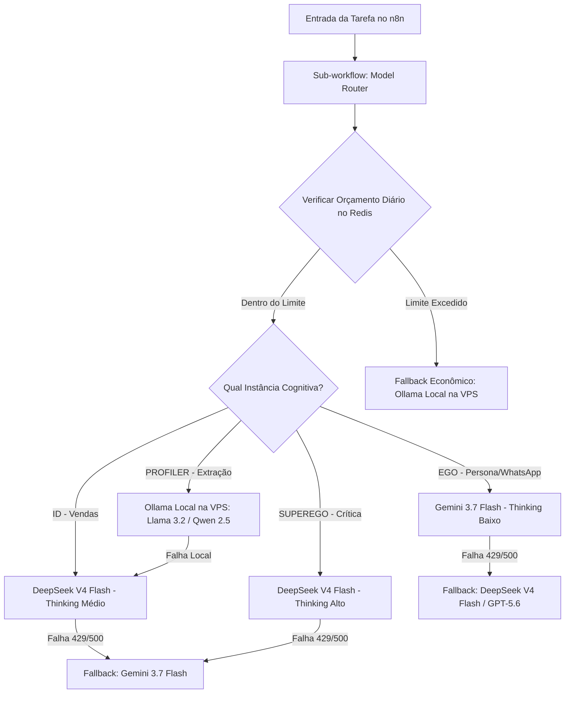

# ARQUITETURA DO MODEL ROUTER & GOVERNANÇA 24/7 (SISTEMA EGÓICO)

Este documento define a arquitetura adaptativa de roteamento de inteligências artificiais para operação contínua 24/7 na VPS Hostinger (`179.197.74.26`), sem aprisionamento a um único provedor e com controle estrito de custos.

---

## 1. Matriz de Alocação de Modelos

| Instância | Modelo Primário | Nível de Raciocínio (Thinking) | Quando Escalar para Pro | Fallback Automático |
| :--- | :--- | :--- | :--- | :--- |
| **ID (Motor de Vendas)** | DeepSeek V4 Flash | Médio | Objeções complexas de alto ticket | Gemini 3.7 Flash |
| **SUPEREGO (Compliance/Anti-Ban)** | DeepSeek V4 Flash | Alto | Conflitos graves ou lead hostil | Gemini 3.7 Flash |
| **EGO (Persona WhatsApp)** | Gemini 3.7 Flash | Baixo (Latência < 1s) | N/A (foco em humanização e fluidez) | DeepSeek V4 Flash / GPT-5.6 |
| **PROFILER (Classificação/Memória)** | Ollama Local na VPS (`ollama:11434`) | Zero (direto) | N/A | DeepSeek V4 Flash |

---

## 2. Princípios de Governança e Otimização

1. **Variáveis de Ambiente Globais (Zero Hardcode):**
   - Todos os endpoints, chaves de API, modelos e temperaturas são lidos do `.env` ou das credenciais do n8n (`n8n.glitchorganic.com`).
2. **IA Local como Primeira Opção para Tarefas Mecânicas:**
   - Tarefas de classificação de sentimento, extração de JSON, perfilamento e resumo de histórico rodam no container local do Ollama (`https://chat.glitchorganic.com`), com custo R$ 0,00 e sem consumir quotas de API.
3. **APIs Pagas Apenas para Agregação de Valor Real:**
   - DeepSeek V4 entra para o raciocínio estratégico e crítico (Id/Superego).
   - Gemini 3.7 Flash entra na linha de frente do WhatsApp para garantir linguagem natural, ritmo humanizado e resposta instantânea.
4. **Teto de Custo Diário e Mensal (Cost Guardrail):**
   - O Redis armazena as chaves `daily_spent_usd:YYYY-MM-DD` e `monthly_spent_usd:YYYY-MM`.
   - Se o consumo diário atingir o teto estipulado (ex: \$2.00/dia), o Model Router força o chaveamento para o Ollama local e envia um alerta ao administrador no Telegram.
5. **Resiliência 24/7 na VPS Hostinger:**
   - Healthcheck contínuo via Uptime Kuma (`status.glitchorganic.com`).
   - Todos os containers operam com política de reinício `restart: unless-stopped`.
